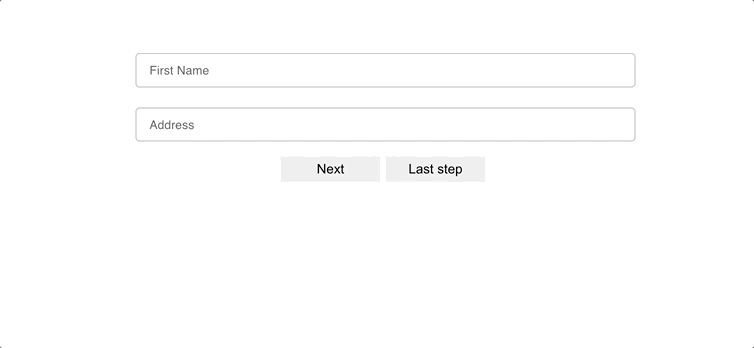

# React Formik Stepper



[](https://www.npmjs.com/package/react-formik-stepper)

A flexible multistep wizard built for React and Formik

## Install

```bash
npm install --save react-formik-stepper

```

or

```bash
yarn add react-formik-stepper

```

## Import Component

```js
import FormikStepper from 'react-formik-stepper';
```

## JSX Syntax

Simply create a wrapper with <FormikStepper></FormikStepper> and each child component will be treated as an individual step.

```js
<FormikStepper initialValues={{}} onSubmit={}>
  <Step1 />
  <Step2
    validation={{
      email: yup.string().required(),
    }}
  />
  ...
  <Step5 />
  <WhateverComponentName />
</FormikStepper>
```

and then in each step

```js
import { useFormikContext } from 'formik';

const formik = useFormikContext();
```

## Props

Available in all steps.

| Prop         | Data Type |
| ------------ | --------- |
| previousStep | function  |
| nextStep     | function  |
| goToStep     | function  |
| firstStep    | number    |
| lastStep     | number    |

```js
<div>
  <!-- Variables -->
  <h2>Step {this.props.currentStep}</h2>
  <p>Total Steps: {this.props.totalSteps}</p>
  <!-- Functions -->
  <p><button onClick={this.props.previousStep}>Previous Step</button></p>
  <p><button onClick={this.props.nextStep}>Next Step</button></p>
  <p><button onClick={()=>this.props.goToStep(2)}>Step 2</button></p>
  <p><button onClick={this.props.firstStep}>First Step</button></p>
  <p><button onClick={this.props.lastStep}>Last Step</button></p>
</div>
```

## FormikStepper Props

| Prop                                                              | Data Type | Description                                                                                                                                                                                                                                   |
| ----------------------------------------------------------------- | --------- | --------------------------------------------------------------------------------------------------------------------------------------------------------------------------------------------------------------------------------------------- |
| initialValues                                                     | Values    | Initial field values of the form, Formik will make these values available to render methods component as values. https://formik.org/docs/api/formik#initialvalues-values                                                                      |
| onSubmit                                                          | function  | Your form submission handler. https://formik.org/docs/api/formik#onsubmit-values-values-formikbag-formikbag--void--promiseany                                                                                                                 |
| onReset                                                           | function  | Your optional form reset handler. https://formik.org/docs/api/formik#onreset-values-values-formikbag-formikbag--void                                                                                                                          |
| validate                                                          | function  | I suggest using yup for validation in each step. However, validate is a dependency-free, out of the box way to validate your forms. https://formik.org/docs/api/withFormik#validate-values-values-props-props--formikerrorsvalues--promiseany |
| validateOnChange                                                  | boolean   | Default is true. Determines if form validation should or should not be run after any array manipulations.                                                                                                                                     |
| https://formik.org/docs/api/fieldarray#validateonchange-boolean   |
| validateOnBlur                                                    | boolean   | Default is true. Use this option to run validations on blur events. More specifically, when either handleBlur, setFieldTouched, or setTouched are called                                                                                      |
| https://formik.org/docs/api/withFormik#validateonblur-boolean     |
| validateOnMount                                                   | boolean   | Default is false. Use this option to tell Formik to run validation (at low priority) when the wrapped component mounts and/or initialValues change.                                                                                           |
| https://formik.org/docs/api/withFormik#validateonmount-boolean    |
| enableReinitialize                                                | boolean   | Default is false. Control whether Formik should reset the form if the wrapped component props change (using deep equality).                                                                                                                   |
| https://formik.org/docs/api/withFormik#enablereinitialize-boolean |
| animate                                                           | boolean   | Default is true. Uses animation from [Animate CSS](https://animate.style/)                                                                                                                                                                    |

## Step Props

| Prop       | Data Type | Description                     |
| ---------- | --------- | ------------------------------- |
| validation | object    | Enter validation for each step. |
